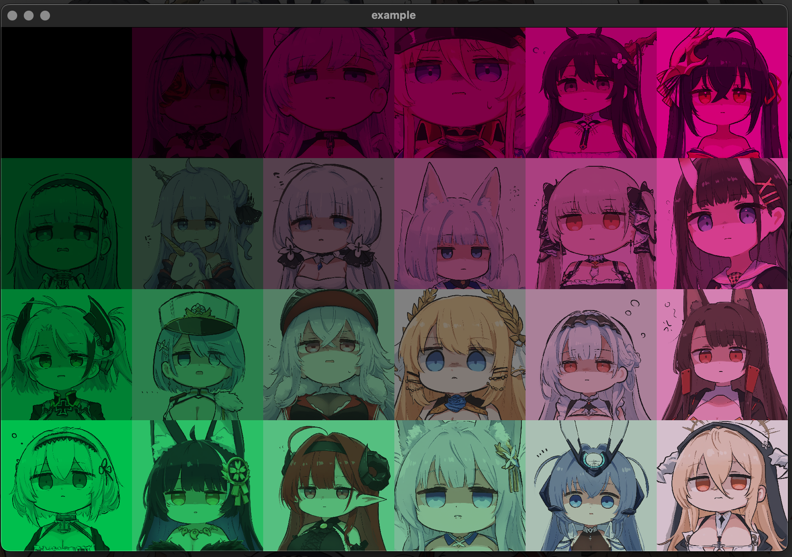

# Xgl2d (Xiang's OpenGL 2D Library)

练手项目,用学过的东西做一个能跑的 2D 图形库

## Second Level Heading

源码文件夹:

- Shader
  - 读取”assets/shader/“目录下的 glsl 着色器源代码文件简单实现了 uniform 变量的编辑
- Texture
  - 单独实现了纹理文件的读取,类中保留可访问 gpu 的 GLuint 纹理对象(句柄？)
- Mesh

  - 基类 Xmesh 实现 mesh 的全部顶点缓冲对象管理和数组对象的描述
  - Xquadmesh 类 实现顶点元素索引缓冲对象的自动管理,外部调用 drawquad 在帧缓冲区绘制矩形
  - Xcirclemesh 类 圆的顶点索引管理和绘制(实现中)
  - Xlinestripmesh 类 线段的实现(实现中)
  - Xovalmesh 类 椭圆的实现(实现中)
  - Xpolygonmesh 类 多边形的实现(实现中)
  - Xtextmesh 类 文本的实现(实现中)

- main.cpp 示例(
  
