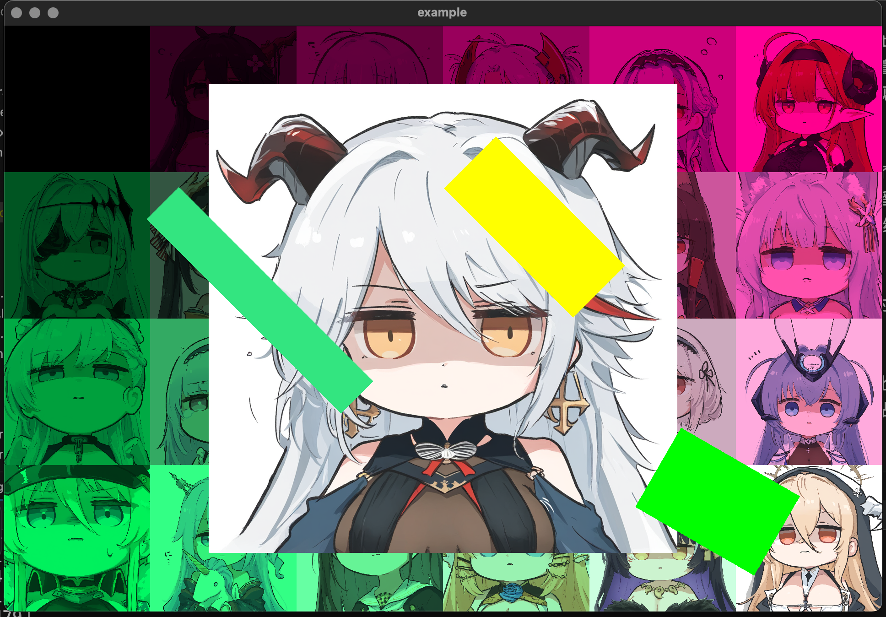
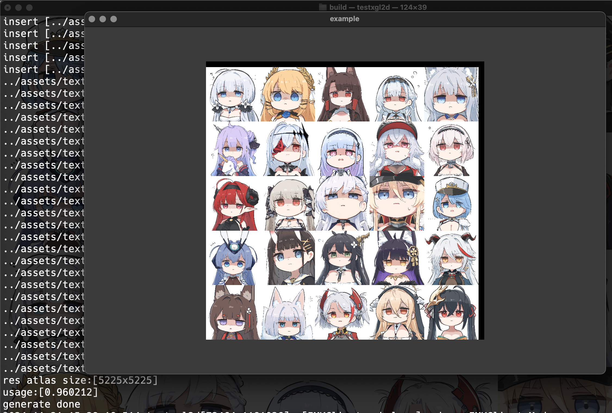
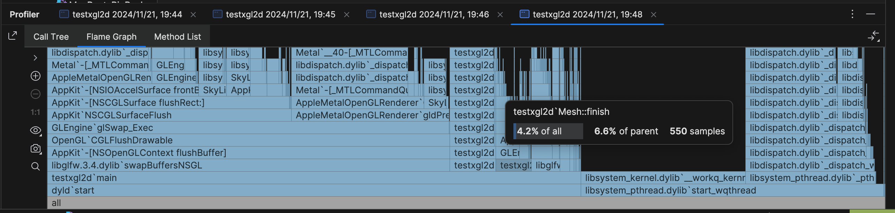
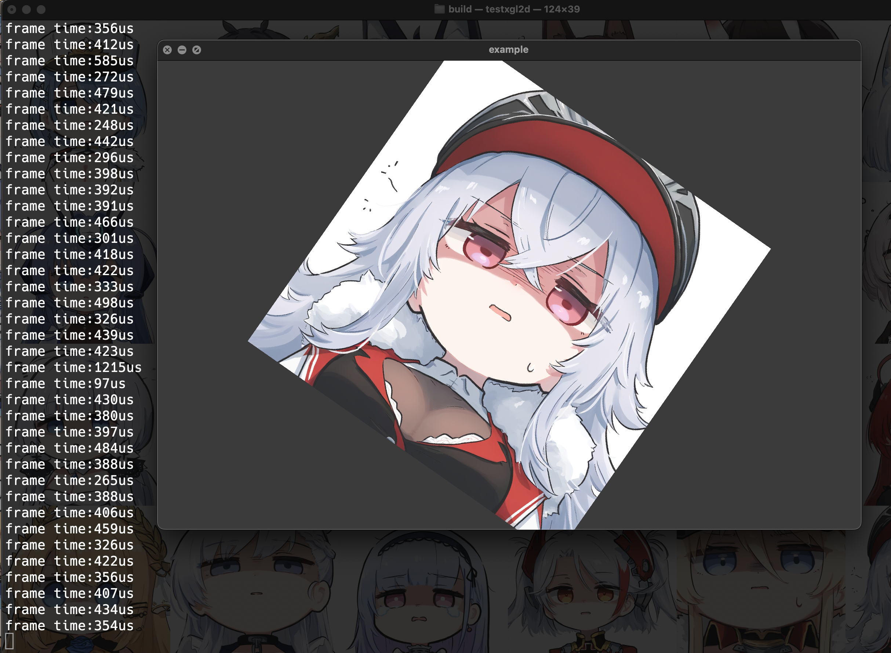

# Xgl2d (Xiang's OpenGL 2D Library)

练手项目,用学过的东西做一个能跑的 2D 图形库

## 源码文件夹 
- Shader
  - 读取”assets/shader/“目录下的 glsl 着色器源代码文件简单实现了 uniform 变量的编辑
- Texture
  - 单独实现了纹理文件的读取,类中保留可访问 gpu 的 GLuint 纹理对象
- Mesh
  - 实现网格对象，存储各种图形对象，使用增量合并更新显存
  - 使用实例化渲染图形 + 实例化纹理贴图变换和矩形变换

- main.cpp 示例
  
- 纹理图集生成:
  
- 无限旋转测试
  
- 纹理集性能测试(帧时间从2000us提升到400us,五倍)
  
