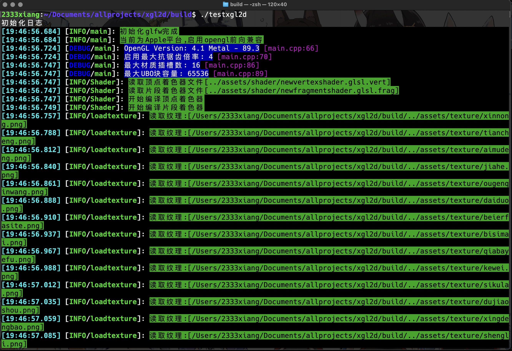
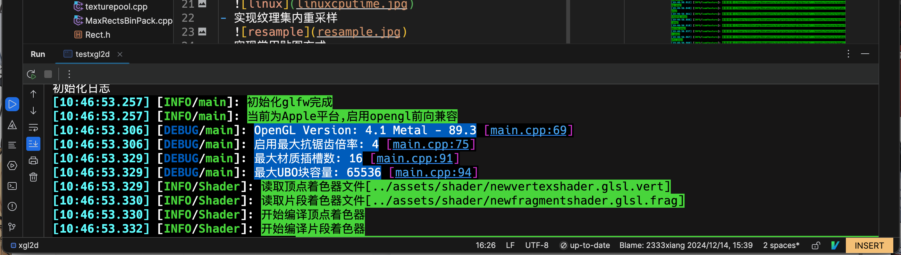
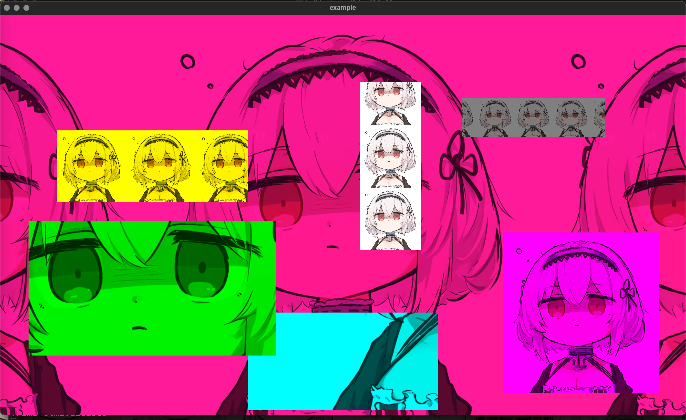

# Xgl2d (Xiang's OpenGL 2D Library)

练手项目,用学过的东西做一个能跑的 2D 图形库

## 源码文件夹 
- Shader
  - 读取”assets/shader/“目录下的 glsl 着色器源代码文件简单实现 uniform 变量的编辑
- Texture
  - 单独实现纹理文件的读取,类中保留可访问 gpu 的 GLuint 纹理对象
- Mesh
  - 实现网格对象，存储各种图形对象，使用增量合并更新显存
  - 使用实例化渲染图形 + 实例化纹理贴图变换和矩形变换

- 日志系统
  
- 修复模拟终端日志崩溃bug(Clion等ide中)
  
- 统一化绘制椭圆和矩形(好像真又是同一种东西Oval类直接删了)
  
- linux测试(差太远了)(旁边预加载纹理的固定消耗)
  
- 实现纹理集内重采样
  
- 实现常用贴图方式
  
- 紫色:填充矩形
- 青色:相对纹理宽高自动重采样和裁剪(以左下角为基准)
- 绿色:相对纹理宽高自动重采样和裁剪(以中心为基准)
- 黄色:适应高并以左下角为基准向右重采样
- 灰色:适应高并以中心为基准扩散重采样
- 白色:适应宽并以左下角为基准向上重采样
## 使用
- 源图
  
- 应用扩散采样
  
